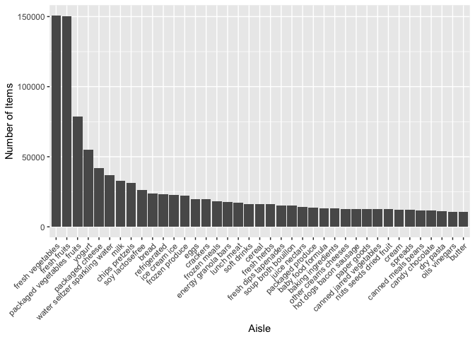
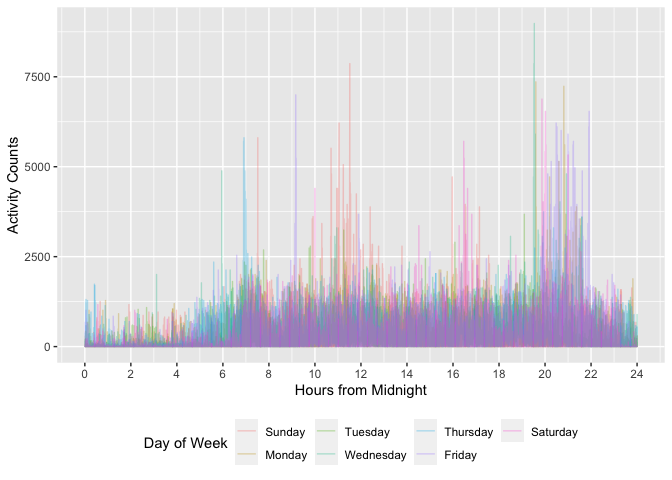
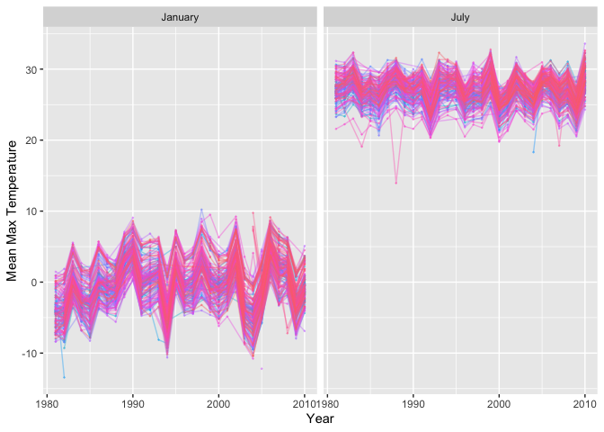
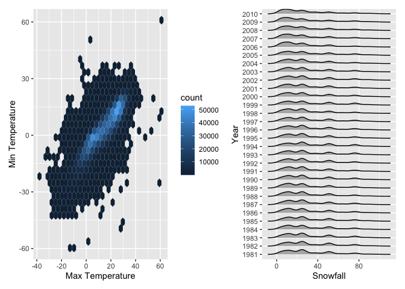

p8105_hw3_sc5154
================
Shaohan Chen
2022-10-11

This is the solution of P8105 Data Science Homework3.

Load necessary packages and the dataset we are about to use.

``` r
library(p8105.datasets)
library(tidyverse)
library(ggridges)
library(patchwork)
```

## Problem 1

``` r
data("instacart")

instacart = 
  instacart %>% 
  as_tibble(instacart)
```

``` r
ins_df = instacart %>%
  janitor::clean_names()
```

The size of the dataset is: there are 1384617 rows and 15 columns in the
dataset.

The variables in the dataset are: order_id, product_id,
add_to_cart_order, reordered, user_id, eval_set, order_number,
order_dow, order_hour_of_day, days_since_prior_order, product_name,
aisle_id, department_id, aisle, department.

Key variables include indicators for user, order, and product.
Order-level variables include ‘order_dow’ and ‘order_hour_of_day’ which
describe the day and time of order. Item-level variables include
‘product_name’, ‘department’ and ‘aisle’ which describe specific
information of the product. There are also some other descriptive
variables like ‘add_to_cart_order’ which means order in which each
product was added to cart, and ‘reordered’ indicates if this product has
been ordered by this user.

In total, there are 39123 distinct products found in 131209 distinct
orders from 131209 distinct users.

Example observations of this dataset can be seen as follows:

``` r
head(ins_df[1:9],5)
## # A tibble: 5 × 9
##   order_id product_id add_to_c…¹ reord…² user_id eval_…³ order…⁴ order…⁵ order…⁶
##      <int>      <int>      <int>   <int>   <int> <chr>     <int>   <int>   <int>
## 1        1      49302          1       1  112108 train         4       4      10
## 2        1      11109          2       1  112108 train         4       4      10
## 3        1      10246          3       0  112108 train         4       4      10
## 4        1      49683          4       0  112108 train         4       4      10
## 5        1      43633          5       1  112108 train         4       4      10
## # … with abbreviated variable names ¹​add_to_cart_order, ²​reordered, ³​eval_set,
## #   ⁴​order_number, ⁵​order_dow, ⁶​order_hour_of_day
head(ins_df[10:15],5)
## # A tibble: 5 × 6
##   days_since_prior_order product_name              aisle…¹ depar…² aisle depar…³
##                    <int> <chr>                       <int>   <int> <chr> <chr>  
## 1                      9 Bulgarian Yogurt              120      16 yogu… dairy …
## 2                      9 Organic 4% Milk Fat Whol…     108      16 othe… dairy …
## 3                      9 Organic Celery Hearts          83       4 fres… produce
## 4                      9 Cucumber Kirby                 83       4 fres… produce
## 5                      9 Lightly Smoked Sardines …      95      15 cann… canned…
## # … with abbreviated variable names ¹​aisle_id, ²​department_id, ³​department
```

As you can see, the variable `order_id` takes integer values like 1,
`product_name` are characters like ‘Bulgarian Yogurt’.

Next we answer the required questions.

*Question 1.* How many aisles are there, and which aisles are the most
items ordered from?

-   How many aisles are there:

``` r
aisle_cnt = 
  ins_df %>% 
  select(aisle_id, aisle) %>% 
  distinct %>%
  nrow
```

There are 134 aisles totally.

-   Which aisles are the most items ordered from:

``` r
most_aisle = 
  ins_df %>%
  group_by(aisle_id, aisle) %>%
  summarize(n_obs = n()) %>%
  arrange(-n_obs, aisle) %>%
  head(5)
most_aisle
## # A tibble: 5 × 3
## # Groups:   aisle_id [5]
##   aisle_id aisle                       n_obs
##      <int> <chr>                       <int>
## 1       83 fresh vegetables           150609
## 2       24 fresh fruits               150473
## 3      123 packaged vegetables fruits  78493
## 4      120 yogurt                      55240
## 5       21 packaged cheese             41699
```

It can be seen that the top 5 aisles that most items ordered from are:

‘fresh vegetables’, ’ fresh fruits’, ‘packaged vegetables fruits’,
‘yogurt’, ‘packaged cheese’. And ‘fresh vegetables’ is the most items
ordered from.

*Question 2.* Make a plot that shows the number of items ordered in each
aisle, limiting this to aisles with more than 10000 items ordered.
Arrange aisles sensibly, and organize your plot so others can read it.

The plot which display aisles with top most number of items ordered:

``` r
ins_df %>%
  group_by(aisle_id, aisle) %>%
  summarize(n_obs = n()) %>%
  filter(n_obs > 10000) %>%
  arrange(-n_obs, aisle) %>%
  mutate(aisle = factor(aisle)) %>%
  ggplot(aes(x = reorder(aisle, -n_obs), y = n_obs)) +
    geom_col() +
    scale_x_discrete(guide = guide_axis(angle = 45)) +
    labs(x = "Aisle", y = "Number of Items") 
```

<!-- -->

*Question 3.* Make a table showing the three most popular items in each
of the aisles “baking ingredients”, “dog food care”, and “packaged
vegetables fruits”. Include the number of times each item is ordered in
your table.

``` r
ins_df %>%
  filter(aisle == 'baking ingredients' | aisle == 'dog food care' | aisle == 'packaged vegetables fruits') %>%
  group_by(aisle, product_name) %>%
  summarize(item_order_times = n()) %>%
  mutate(item_rank = min_rank(-item_order_times)) %>%
  arrange(-item_order_times) %>%
  filter(item_rank <= 3) %>%
  knitr::kable()
```

| aisle                      | product_name                                  | item_order_times | item_rank |
|:---------------------------|:----------------------------------------------|-----------------:|----------:|
| packaged vegetables fruits | Organic Baby Spinach                          |             9784 |         1 |
| packaged vegetables fruits | Organic Raspberries                           |             5546 |         2 |
| packaged vegetables fruits | Organic Blueberries                           |             4966 |         3 |
| baking ingredients         | Light Brown Sugar                             |              499 |         1 |
| baking ingredients         | Pure Baking Soda                              |              387 |         2 |
| baking ingredients         | Cane Sugar                                    |              336 |         3 |
| dog food care              | Snack Sticks Chicken & Rice Recipe Dog Treats |               30 |         1 |
| dog food care              | Organix Chicken & Brown Rice Recipe           |               28 |         2 |
| dog food care              | Small Dog Biscuits                            |               26 |         3 |

*Question 4.* Make a table showing the mean hour of the day at which
Pink Lady Apples and Coffee Ice Cream are ordered on each day of the
week; format this table for human readers (i.e. produce a 2 x 7 table).

``` r
ins_df %>%
  filter(product_name == 'Pink Lady Apples' | product_name == 'Coffee Ice Cream') %>%
  group_by(order_dow, product_name) %>%
  summarize(mean_order_hour = mean(order_hour_of_day)) %>%
  pivot_wider(
    names_from = order_dow,
    values_from = mean_order_hour
  ) %>%
  knitr::kable(digits = 2)
```

| product_name     |     0 |     1 |     2 |     3 |     4 |     5 |     6 |
|:-----------------|------:|------:|------:|------:|------:|------:|------:|
| Coffee Ice Cream | 13.77 | 14.32 | 15.38 | 15.32 | 15.22 | 12.26 | 13.83 |
| Pink Lady Apples | 13.44 | 11.36 | 11.70 | 14.25 | 11.55 | 12.78 | 11.94 |

## Problem 2

*Question 1.* Load, tidy, and otherwise wrangle the data. Your final
dataset should include all originally observed variables and values;
have useful variable names; include a weekday vs weekend variable; and
encode data with reasonable variable classes. Describe the resulting
dataset (e.g. what variables exist, how many observations, etc).

``` r
accel_df = read_csv("Data/accel_data.csv") %>%
  janitor::clean_names() %>%
  pivot_longer(
    activity_1:activity_1440,
    names_to = 'activity_index',
    names_prefix = 'activity_',
    values_to = 'activity_cnt'
  ) %>%
  mutate(
  day = factor(day, levels = c('Sunday', 'Monday', 'Tuesday', 'Wednesday', 'Thursday', 'Friday', 'Saturday')),
  is_weekday = ifelse((day == 'Saturday' | day == 'Sunday'), 0, 1),
  activity_index = as.numeric(activity_index)
  ) %>%
  arrange(week, day_id)
head(accel_df)
## # A tibble: 6 × 6
##    week day_id day    activity_index activity_cnt is_weekday
##   <dbl>  <dbl> <fct>           <dbl>        <dbl>      <dbl>
## 1     1      1 Friday              1         88.4          1
## 2     1      1 Friday              2         82.2          1
## 3     1      1 Friday              3         64.4          1
## 4     1      1 Friday              4         70.0          1
## 5     1      1 Friday              5         75.0          1
## 6     1      1 Friday              6         66.3          1
```

The resulting dataset has 50400 rows and 6 columns.

The existing variables include week, day_id, day, activity_index,
activity_cnt, is_weekday. Where ‘is_weekday’ is the new variable to
indicate whether it is a weekday or weekend; ‘activity_index’ and
‘activity_cnt’ are manually added variables transformed from original
observations using `pivot_longer`. The rest of the variables are time
for activity record.

*Question 2.* Traditional analyses of accelerometer data focus on the
total activity over the day. Using your tidied dataset, aggregate across
minutes to create a total activity variable for each day, and create a
table showing these totals. Are any trends apparent?

``` r
accel_df %>%
  group_by(week, day) %>%
  summarize(daily_activity_tot = sum(activity_cnt)) %>%
  arrange(week, day) %>%
  pivot_wider(
    names_from = day,
    values_from = daily_activity_tot
  ) %>%
  knitr::kable()
```

| week | Sunday |    Monday |  Tuesday | Wednesday | Thursday |   Friday | Saturday |
|-----:|-------:|----------:|---------:|----------:|---------:|---------:|---------:|
|    1 | 631105 |  78828.07 | 307094.2 |    340115 | 355923.6 | 480542.6 |   376254 |
|    2 | 422018 | 295431.00 | 423245.0 |    440962 | 474048.0 | 568839.0 |   607175 |
|    3 | 467052 | 685910.00 | 381507.0 |    468869 | 371230.0 | 467420.0 |   382928 |
|    4 | 260617 | 409450.00 | 319568.0 |    434460 | 340291.0 | 154049.0 |     1440 |
|    5 | 138421 | 389080.00 | 367824.0 |    445366 | 549658.0 | 620860.0 |     1440 |

The daily total activities tend to change with fluctuation within each
week. The daily total activity counts on Saturday for last two weeks are
both 1440 which means the activity counts is 1 for every minute. That
seems to be abnormal and the data on these two days could be considered
as outliers.

*Question 3.* Accelerometer data allows the inspection activity over the
course of the day. Make a single-panel plot that shows the 24-hour
activity time courses for each day and use color to indicate day of the
week. Describe in words any patterns or conclusions you can make based
on this graph.

``` r
accel_df %>%
  mutate(
    daily_time = floor((activity_index)/60) +
      (1/60) * (activity_index) %% 60
    ) %>%
  ggplot(aes(x = daily_time, y = activity_cnt, color = day)) +
    geom_line(alpha = 0.3) + 
    theme(legend.position = 'bottom') + 
    scale_x_continuous(limits = c(0,24), breaks = seq(0, 24, 2)) +
    labs(x = 'Hours from Midnight', 
         y = 'Activity Counts', 
         color = 'Day of Week')
```

<!-- -->

Based on this graph, we have:

-   Generally in each day, the activity counts tend to be lower at late
    night, midnight and early morning from around 24 pm to 6 am, and
    higher between 6am to 22 pm. Generally the activity counts would
    reach a peak between around 11 am to 13 pm, and reach a higher peak
    between around 20 pm to 22pm.

-   There are some extreme points, such as that on Sunday and Friday,
    when the level becomes extremely high on Sunday noon and Friday
    night.

## Problem 3

``` r
data("ny_noaa")
```

For the raw dataset, the dataset has 2595176 rows and 7 columns.
Variables include id, date, prcp, snow, snwd, tmax, tmin.

Next ,let’s do some data exploration of the dataset.

*Question 1.* Do some data cleaning. Create separate variables for year,
month, and day. Ensure observations for temperature, precipitation, and
snowfall are given in reasonable units. For snowfall, what are the most
commonly observed values? Why?

Clean the datasets.

``` r
noaa_df = 
  ny_noaa %>%
  janitor::clean_names() %>%
  separate(date, c("year", "month", "day"), sep = "-", convert = TRUE) %>%
  mutate(
    month = month.name[as.integer(month)],
    prcp = prcp / 10,
    tmax = as.numeric(tmax) / 10, 
    tmin = as.numeric(tmin) / 10
    )
```

The resulting dataset has 2595176 rows and 9 columns.

The existing variables include id, year, month, day, prcp, snow, snwd,
tmax, tmin. Where ‘id’ is the id of recording station; ‘year’, ‘month’,
‘station’ is the time variable; ‘prcp’, ‘snow’, ‘snwd’, ‘tmax’ and
‘tmin’ are weather variables respectively stands for Precipitation
(tenths of mm), Snowfall (mm), Snow depth (mm), Maximum temperature
(tenths of degrees C), Minimum temperature (tenths of degrees C).

``` r
most_snow = 
  noaa_df %>%
  group_by(snow) %>%
  summarize(n_obs = n()) %>%
  arrange(-n_obs) %>%
  head(1)
```

For snowfall, the most commonly observed values are: 0 with 2008508
observations. That’s probably because the New York State does not often
snow.

*Question 2.* Make a two-panel plot showing the average max temperature
in January and in July in each station across years. Is there any
observable / interpretable structure? Any outliers?

``` r
noaa_df %>%
  filter(month == 'January' | month == 'July') %>%
  group_by(month, id, year) %>%
  summarize(mean_tmax = mean(tmax, na.rm = TRUE)) %>%
  ggplot(aes(x = year, y = mean_tmax, color = id)) +
  geom_point(size = 0.2, alpha = 0.5) +
  geom_path(alpha = 0.5) +
  theme(legend.position = "none") + 
  labs(x = 'Year', y = "Mean Max Temperature") +
  facet_grid(. ~ month)
## Warning: Removed 5970 rows containing missing values (geom_point).
## Warning: Removed 5640 row(s) containing missing values (geom_path).
```

<!-- -->

Based on the two-panel plot, the range of max temperature(tmax) in
January is around -10 to 10 (degree C), in July is around 20 to 30.
Generally the mean tmax in July is much higher than January. And the
temperature difference range in January is around 20, which is larger
than in July that is around 10. There is some outliers in January and
July. In January there are extremely low tmax lower than -10 and
extremely high tmax close to 10. In July there are also extremely high
tmax close to 35 and extremely low tmax lower than 15.

In addition, generally the distributions of max temperature in January
and July are changing with fluctuation during the past years, with
average tmax around 0 in January and average tmax around 27 in July.

*Question 3.* Make a two-panel plot showing (i) tmax vs tmin for the
full dataset (note that a scatterplot may not be the best option); and
(ii) make a plot showing the distribution of snowfall values greater
than 0 and less than 100 separately by year.

``` r
tmax_vs_tmin = 
  noaa_df %>%
  ggplot(aes(x = tmax, y = tmin)) +
  geom_hex() + 
  labs(x = 'Max Temperature', y = "Min Temperature")

snowfall_dis = 
  noaa_df %>%
  filter(snow > 0 & snow < 100) %>%
  mutate(year = factor(year)) %>%
  ggplot(aes(x = snow, y = year)) + 
  geom_density_ridges(scale = 0.8) +
  labs(x = 'Snowfall', y = "Year")

tmax_vs_tmin + snowfall_dis
## Warning: Removed 1136276 rows containing non-finite values (stat_binhex).
```

<!-- -->
