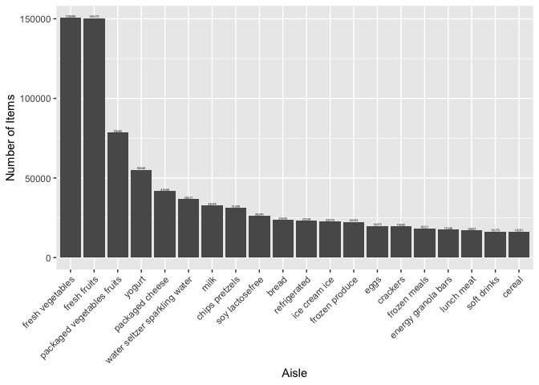

p8105_hw3_sc5154
================
Shaohan Chen
2022-10-11

This is the solution of P8105 Data Science Homework3.

Load necessary pacakges and the dataset we are about to use.

``` r
library(tidyverse)
library(p8105.datasets)
data("instacart")
```

## Problem 1

``` r
ins_df = instacart %>%
  janitor::clean_names()
```

The size of the dataset is: there are 1384617 rows and 15 columns in the
dataset.

The variables in the dataset include: order_id, product_id,
add_to_cart_order, reordered, user_id, eval_set, order_number,
order_dow, order_hour_of_day, days_since_prior_order, product_name,
aisle_id, department_id, aisle, department.

Key variables like `order_id` stands for the order identifier,
`product_id` stands for product identifier, `add_to_cart_order` means
order in which each product was added to cart, `reordered` indicates if
this product has been ordered by this user, `order_dow` stands for the
day of the week on which the order was placed, `product_name` stands for
the name of the product.

Example observations of this dataset can be seen as follows:

``` r
head(ins_df[1:9],5)
## # A tibble: 5 × 9
##   order_id product_id add_to_c…¹ reord…² user_id eval_…³ order…⁴ order…⁵ order…⁶
##      <int>      <int>      <int>   <int>   <int> <chr>     <int>   <int>   <int>
## 1        1      49302          1       1  112108 train         4       4      10
## 2        1      11109          2       1  112108 train         4       4      10
## 3        1      10246          3       0  112108 train         4       4      10
## 4        1      49683          4       0  112108 train         4       4      10
## 5        1      43633          5       1  112108 train         4       4      10
## # … with abbreviated variable names ¹​add_to_cart_order, ²​reordered, ³​eval_set,
## #   ⁴​order_number, ⁵​order_dow, ⁶​order_hour_of_day
head(ins_df[10:15],5)
## # A tibble: 5 × 6
##   days_since_prior_order product_name              aisle…¹ depar…² aisle depar…³
##                    <int> <chr>                       <int>   <int> <chr> <chr>  
## 1                      9 Bulgarian Yogurt              120      16 yogu… dairy …
## 2                      9 Organic 4% Milk Fat Whol…     108      16 othe… dairy …
## 3                      9 Organic Celery Hearts          83       4 fres… produce
## 4                      9 Cucumber Kirby                 83       4 fres… produce
## 5                      9 Lightly Smoked Sardines …      95      15 cann… canned…
## # … with abbreviated variable names ¹​aisle_id, ²​department_id, ³​department
```

As you can see, the variable `order_id` takes integer values like 1,
`product_name` are characters like ‘Bulgarian Yogurt’.

Next we answer the required questions.

*Question 1.* How many aisles are there, and which aisles are the most
items ordered from?

-   How many aisles are there:

``` r
aisle_cnt = 
  ins_df %>% 
  select(aisle_id, aisle) %>% 
  distinct %>%
  nrow
```

There are 134 aisles totally.

-   Which aisles are the most items ordered from:

``` r
most_aisle = 
  ins_df %>%
  group_by(aisle_id, aisle) %>%
  summarize(n_obs = n()) %>%
  arrange(-n_obs, aisle) %>%
  head(5)
most_aisle
## # A tibble: 5 × 3
## # Groups:   aisle_id [5]
##   aisle_id aisle                       n_obs
##      <int> <chr>                       <int>
## 1       83 fresh vegetables           150609
## 2       24 fresh fruits               150473
## 3      123 packaged vegetables fruits  78493
## 4      120 yogurt                      55240
## 5       21 packaged cheese             41699
```

It can be seen that the top 5 aisles that most items ordered from are:

‘fresh vegetables’, ’ fresh fruits’, ‘packaged vegetables fruits’,
‘yogurt’, ‘packaged cheese’. And ‘fresh vegetables’ is the most items
ordered from

*Question 2.* Make a plot that shows the number of items ordered in each
aisle, limiting this to aisles with more than 10000 items ordered.
Arrange aisles sensibly, and organize your plot so others can read it.

``` r
items_aisle = 
  ins_df %>%
  group_by(aisle_id, aisle) %>%
  summarize(n_obs = n()) %>%
  filter(n_obs > 10000) %>%
  arrange(-n_obs, aisle) %>%
  mutate(aisle = factor(aisle))
```

The aisles with top 20 most number of items ordered:

``` r
ggplot(data = items_aisle[1:20, ], mapping = aes(x = reorder(aisle, -n_obs), y = n_obs)) +
  geom_col() +
  scale_x_discrete(guide = guide_axis(angle = 45)) +
  geom_text(aes(label = n_obs), position = position_dodge(width = 0.9),size =      
  1.0,vjust = -0.25) + 
  labs(x = "Aisle", y = "Number of Items") 
```

<!-- -->

The aisles with top 21 to 39 most number of items ordered:

``` r
ggplot(data = items_aisle[21:39, ], mapping = aes(x = reorder(aisle, -n_obs), y = n_obs)) +
  geom_col() +
  scale_x_discrete(guide = guide_axis(angle = 45)) +
  geom_text(aes(label = n_obs), position = position_dodge(width = 0.9),size =      
  1.0,vjust = -0.25) + 
  labs(x = "Aisle", y = "Number of Items") 
```

<!-- -->

*Question 3.* Make a table showing the three most popular items in each
of the aisles “baking ingredients”, “dog food care”, and “packaged
vegetables fruits”. Include the number of times each item is ordered in
your table.

``` r
ins_df %>%
  filter(aisle == 'baking ingredients' | aisle == 'dog food care' | aisle == 'packaged vegetables fruits') %>%
  group_by(aisle, product_name) %>%
  summarize(item_order_times = n()) %>%
  mutate(item_rank = min_rank(-item_order_times)) %>%
  arrange(aisle, item_rank) %>%
  filter(item_rank <= 3)
## # A tibble: 9 × 4
## # Groups:   aisle [3]
##   aisle                      product_name                        item_…¹ item_…²
##   <chr>                      <chr>                                 <int>   <int>
## 1 baking ingredients         Light Brown Sugar                       499       1
## 2 baking ingredients         Pure Baking Soda                        387       2
## 3 baking ingredients         Cane Sugar                              336       3
## 4 dog food care              Snack Sticks Chicken & Rice Recipe…      30       1
## 5 dog food care              Organix Chicken & Brown Rice Recipe      28       2
## 6 dog food care              Small Dog Biscuits                       26       3
## 7 packaged vegetables fruits Organic Baby Spinach                   9784       1
## 8 packaged vegetables fruits Organic Raspberries                    5546       2
## 9 packaged vegetables fruits Organic Blueberries                    4966       3
## # … with abbreviated variable names ¹​item_order_times, ²​item_rank
```

*Question 4.* Make a table showing the mean hour of the day at which
Pink Lady Apples and Coffee Ice Cream are ordered on each day of the
week; format this table for human readers (i.e. produce a 2 x 7 table).

``` r
ins_df %>%
  filter(product_name == 'Pink Lady Apples' | product_name == 'Coffee Ice Cream') %>%
  group_by(order_dow, product_name) %>%
  summarize(mean_order_hour = mean(order_hour_of_day)) %>%
  pivot_wider(
    names_from = order_dow,
    values_from = mean_order_hour
  )
## # A tibble: 2 × 8
##   product_name       `0`   `1`   `2`   `3`   `4`   `5`   `6`
##   <chr>            <dbl> <dbl> <dbl> <dbl> <dbl> <dbl> <dbl>
## 1 Coffee Ice Cream  13.8  14.3  15.4  15.3  15.2  12.3  13.8
## 2 Pink Lady Apples  13.4  11.4  11.7  14.2  11.6  12.8  11.9
```
